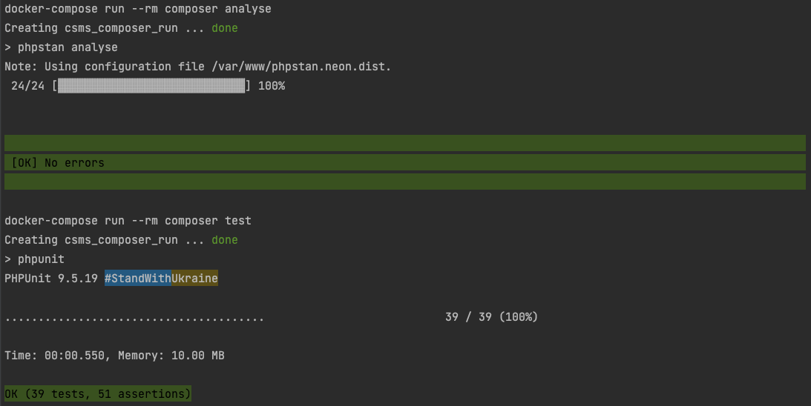

### CSMS - A RESTful API for Applying a rate to a charge detail record

Installation
-----

##### For Simplicity of installation, this repository is provided with `MakeFile`.
You need to have installed docker and docker-compose on your operating system.
First Clone the repository and change directory to the project directory. Then Simply run `make` command in your terminal to install and set everything up and running.

Now, you can access the application through the following URL:

    http://localhost:8000

If you see `It works!` then everything is ready.

### Docker Compose

You may need to go through all the steps:

1. To build `slim` and `mysql` images and run their containers:

   `docker-compose up -d --build slim`

3. To build `composer` image and install all projects dependencies:

   `docker-compose run --rm composer install`

4. To run database migrations with `phinx` tool for `development` and `testing` environment:

   `docker-compose run --rm --entrypoint vendor/bin/phinx composer migrate`

   `docker-compose run --rm --entrypoint vendor/bin/phinx composer migrate --environment=testing`

5. To run `phpstan` code analyses: 

   `docker-compose run --rm composer analyse`

6. To run tests: 

   `docker-compose run --rm composer test`

Tests
-----

Tests are developed with [PHPUnit – The PHP Testing Framework](https://phpunit.de/).
And code has been analysed with [PHPStan](https://phpstan.org/) 

Analyse can be run by running:

      docker-compose run --rm composer analyse

Tests can be run by running:

      docker-compose run --rm composer test

#### Test and Analyse results

Special Note
-----
**To meet functional requirements**

The way that the response are formatted right now ( I mean on master branch commit [367b657](https://github.com/mehrna/csms/commit/367b657300c4b3b947e5cc81af65f706a512fba0) )is much more convenient and well designed than the way on the assessment need, by the way, to meet the Functional requirements, I did it the other way in [this pull request](https://github.com/mehrna/csms/pull/1).

API Documentation
-----
[Restful API Documentation](https://documenter.getpostman.com/view/297526/UVsTr34s) Generated by [Postman](https://www.postman.com/)

Some notes and suggestions
-----

API designers typically focus on questions like “What does this service need to do?” or “What does this service need to provide?”, while API consumers are focused on “How can I use this API to do what I need?”, or more accurately, “How can I spend the bare minimum of effort to get what I need out of this API?”.

Rather than thinking about what your API can do, think about the different ways it may need or want to be used and then focus on making those tasks as easy as possible for your API’s consumers.
We have to take into account security, performance, and ease of use for API consumers.

In my opinion we could make some changes to this API. I only mention some of them and also there would be more specific and general things base on the problem description:

We could implement some sort of different endpoints to make a desired design. For example, provide a small RESTful API that will expose the rate's resource identifier and change the /rate API to accept the rate identifier instead of the whole record.
It totally depends on needs!

Also, it would be a great idea to have a standard formatted response, as we can use [json api](https://jsonapi.org/) best practices for this to format our response body in a very good way.

#### Security

Security is obviously one of the most important things to build into web services and APIs. For most APIs, I prefer a simple token-based authentication (JWT), where the token is a random hash assigned to the user and they can reset it at any point if it has been stolen.
Allow the token to be passed in through POST or an HTTP header. I choose a secure token. Something irreversible is best.

#### Stability and Consistency by Versioning

A good URL scheme will include major versions in the URL. Any change to the output format or supported data types should result in bumping up to a new major version. Generally, it’s acceptable to keep the same version if all you are doing is adding keys or nodes to your output, but to be on the safe side, any time the output changes, bump a version.
In addition to being stable over time, APIs need to be internally consistent.

##### And last but not least,  Documentation is very important

Here are some useful links and best practices that provide bunch of great information about the topic:

- [Best practices for REST API design](https://stackoverflow.blog/2020/03/02/best-practices-for-rest-api-design/)
- [How to Design a REST API](https://restfulapi.net/rest-api-design-tutorial-with-example/)
- [A SPECIFICATION FOR BUILDING APIS IN JSON](https://jsonapi.org/)

Thanks for your consideration 😊